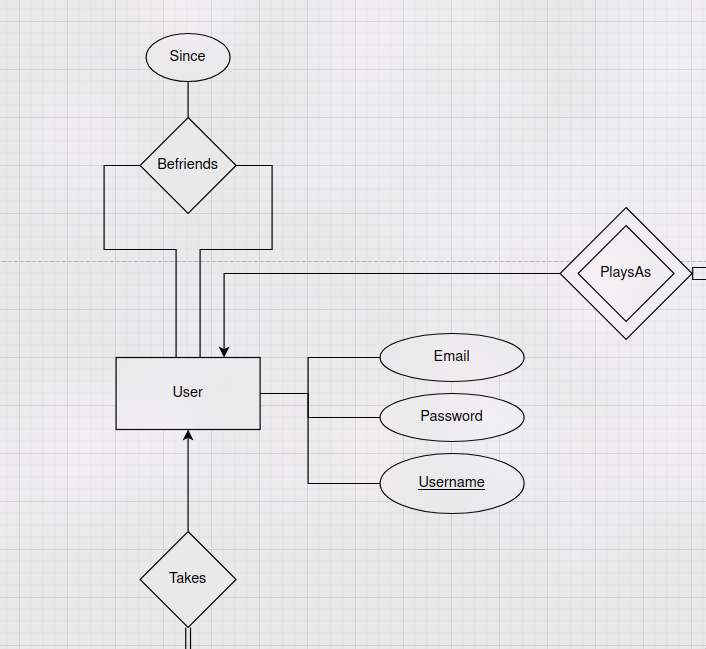
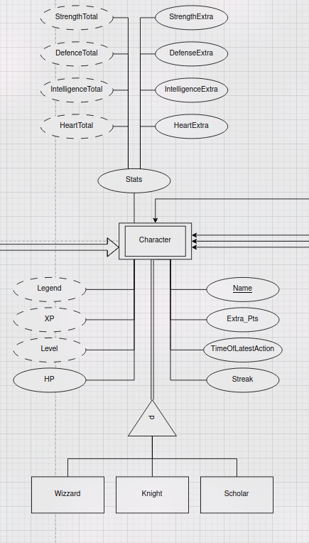
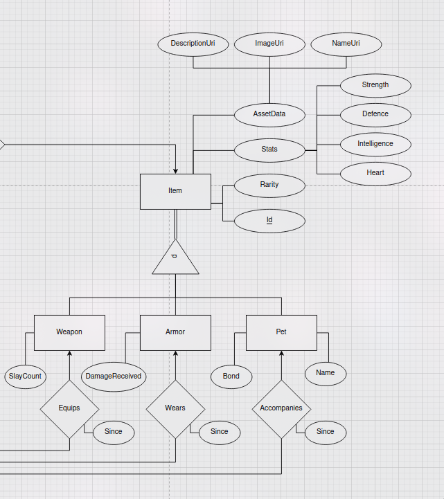
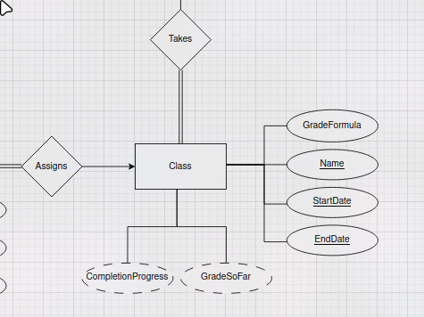
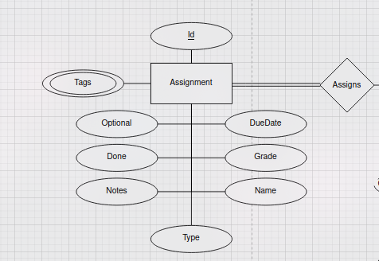
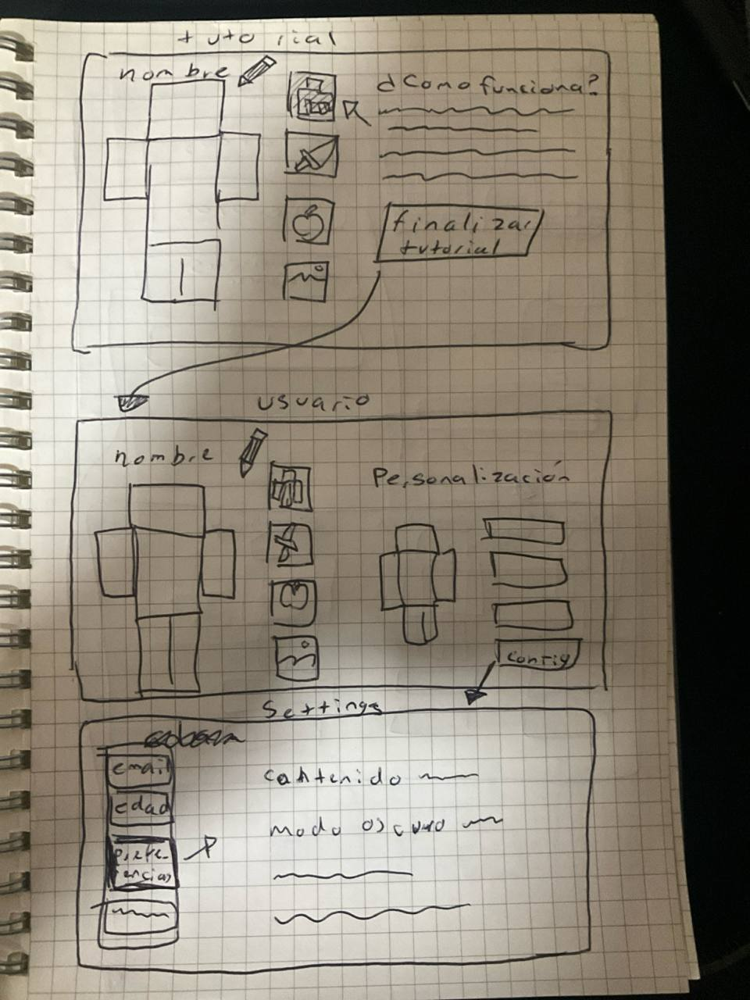
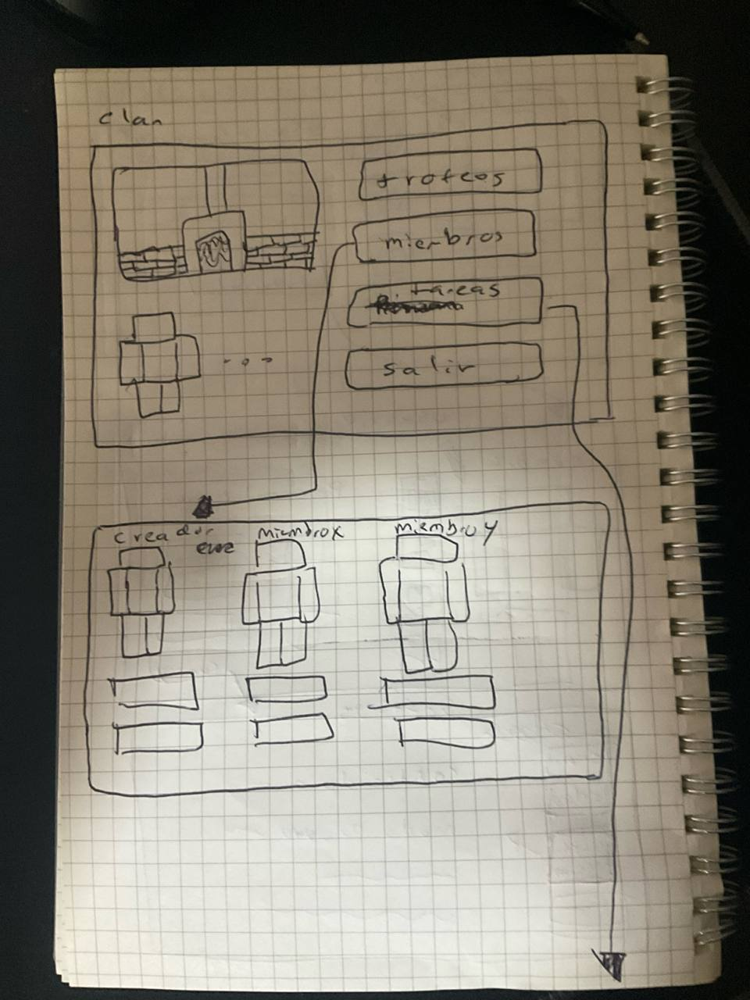
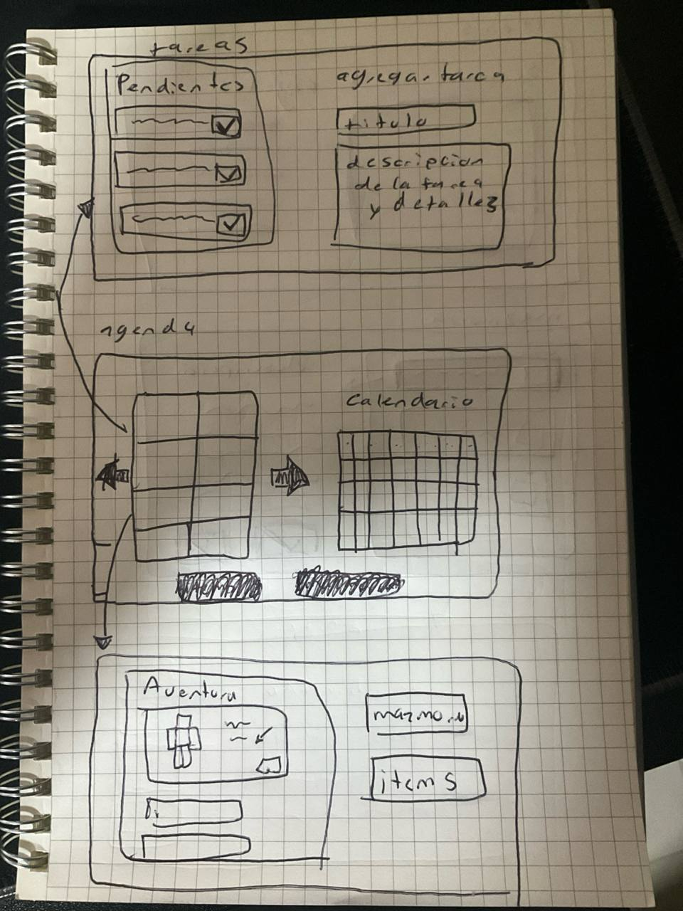
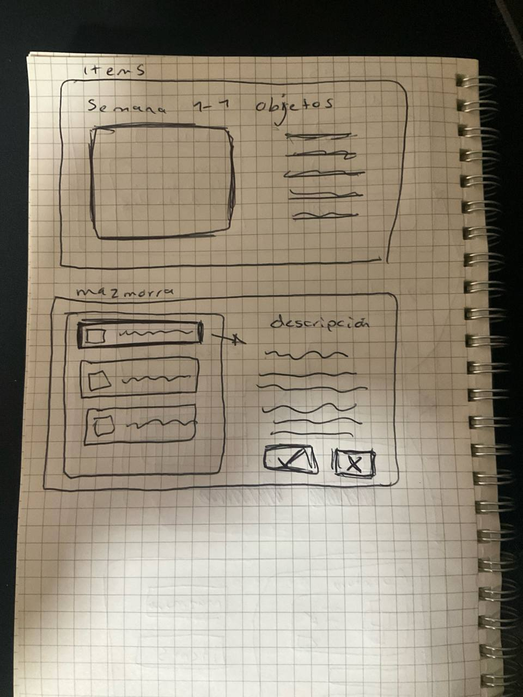

# Estudiantica

## Tabla de contenidos

* [Argumento](#argumento)
* [Especificación](#especificación)
* [Diseño](#diseño)
    * [Base de datos](#base-de-datos)
    * [Diagrama de clases](#diagrama-de-clases)
    * [Interfaz de usuario](#interfaz-de-usuario)
* [API](#api)
    * [Fórmulas de calificación](#fórmulas-de-calificación)


## Especificación
El componente más esencial de la aplicación es una agenda escolar. El aspecto
de *ludificación* sirve para motivar al estudiante a interactuar con los
sistemas de la agenda a través de incentivos y consecuencias.

Para empezar a usar *Estudiantica* el usuario debe crear el personaje con el
cual jugará. A continuación, deberá ingresar sus materias, con la fecha de
inicio y término, así como la manera en que se evaluará sobre 100.

A partir de esto, se da lugar a la interacción principal de la agenda: la
carga, personalización y manejo de trabajos. Las tareas, las prácticas y las
evaluaciones no tienen mayor distinción fuera del peso que tienen para la
calificación de cada materia. Para subir un trabajo se deben configurar los
siguientes aspectos: la materia a la que pertenece el trabajo, su fecha de
entrega y a qué grupo de trabajos pertenece, el cual llamaremos su *tag* o
*etiqueta*.

El estudiante tendrá acceso a distintas métricas respecto a su desempeño como:
calificación por materia y porcentaje de trabajos entregados. Además, podrá ver
una lista de todos sus pendientes en el orden en el que se entregan.

En el aspecto más básico de *ludificación* tu personaje tendrá métricas como
salud, experiencia, fuerza, inteligencia, defensa y corazón. El personaje podrá
subir de nivel a través de buen desempeño académico y buena organización al
entregar trabajos. Por otro lado, si el jugador no tiene actividad en
suficientes días, su personaje morirá y tendrá que crear uno nuevo. Como
incentivo adicional, el contar con una racha prolongada le dará un aumento
porcentual en algunas de sus métricas de juego.

El progreso en el juego estará vinculado al rendimiento académico. A medida que
el estudiante sube de nivel en la aplicación, se le otorgarán puntos asignables
a sus estadísticas. Con aquellas estadísticas podrá participar en eventos
llamados mazmorras, las cuales cuentan con distintos niveles de dificultad y
pondrán a prueba al jugador de manera estocástica. Con base a ello, recibirá
las recompensas que le permitirán personalizar a su personaje e incrementar
sus estadísticas.

## Diseño

Como parte del desarrollo del problema, se tiene el diseño de la base de datos,
de los módulos y de la vista para el usuario.

### Base de datos

Para esto, tendremos las siguientes entidades, resumidas a continuación:
   - User: contiene la información de los usuarios para la aplicación, de esta
     manera se requiere un nombre de usuario, correo y contraseña.

  

   - Character: es el personaje del usuario dentro del videojuego, donde existe
     tres distintas clases (mago, caballero y erudito), donde cada personaje
     tiene su nombre, experiencia, nivel, leyenda, vida, última vez que estuvo
     en acción, su racha y sus stats (máximo de vida, inteligencia, defensa y
     fuerza).

  

   - Item: son los objetos que el personaje puede llevar, el cual tiene
     información de los mismos stats (fuerza, defensa, inteligencia y vida),
     rareza y dependiendo de su tipo puede tener las siguientes
     características:
     - Weapon: debe tener el número de eliminaciones.
     - Armor: debe de tener el nivel de daño recibido.
     - Pet: tiene el vinculo y su nombre.

      
   - Class: son las materias que los usuarios tienen las cuales deben de tener
     su nombre, fecha de inicio y fin, y fórmula de calificación.
  
      

  - Assignment: es la lista de deberes del estudiante, la cual debe de tener
     nombre, calificación, tipo, fecha de finalización, notas, si es opcional y
     tags (las cuales pueden ser varias).
  
Las entidades se tomaron de esta manera, ya que engloba la mayoría de las
acciones que hará la aplicación y nos permite acoplarlo con el resto de los
módulos, los cuales se detallarán en la siguiente sección.


Procedamos dando una descripción más detallada del diseño.

Partiendo por el usuario, esta entidad se encargará de toda la información de
la cuenta separada de las mecánicas de juego mismas. Sus atributos serán el
nombre de usuario, un hash de la contraseña, y correo electrónico para los
recordatorios y recuperación de la cuenta.

Un usuario puede agregar como amigo a otro usuario. Ambos deben agregarse como
amigos para que tengan acceso a las características de amistad, por lo tanto
será una tupla no conmutativa.

Los clanes son grupos de estudio, en los cuales puede un estudiante pertenecer
sólo a uno, y es administrado por sólo un usuario. Además, un clan puede
invitar a varios usuarios, con una fecha de expiración por invitación. Cuentan
con un logo, descripción, nombre, su propio XP por actividades completadas, y
número de victorias.

Un usuario puede tomar varias clases. Se puede registrar una fórmula para
calcular el promedio, que pueden ser construidas componiendo funciones
aritméticas simples, como suma, resta, producto, división, promedio, máximo y
mínimo, sobre las tareas con ciertas etiquetas.

Las clases se identifican por no sólo sus nombres, pues podría alguien
recusarlas, pero también por su fecha de inicio y término. Además debería ser
posible conocer el promedio con el progreso actual, y cuánto falta para
completar la materia.

Las clases dejan *asignaciones*, las cuales pueden ser tareas, exámenes,
prácticas, material, y demás. Estas cuentan con un id generado por la base
de datos, un conjunto de etiquetas, valores booleanos de si está realizada y
si es opcional, tiene fecha de entrega opcional, la calificación obtenida
(o si aún no está obtenida), notas adicionales y nombre de tarea.

A partir de la entidad de personaje comienza todo lo relacionado con los
elementos de juego. El personaje mismo debe ser uno de tres clases, un
hechicero, un caballero o un erudito.

El personaje tiene un nombre separado del nombre del usuario, pues el personaje
puede perderse por falta de consistencia y resultados. En ese caso, se pierde
el progreso de los componentes de juego, pero no de los datos de la cuenta del
usuario. Por esta razón precisamente está separado el personaje del usuario.

Para lo anterior, se cuenta con una fecha de última acción del personaje para
calcular el tiempo de inactividad, así como la racha para poder calcular
recompensas adicionales y el HP (salud) si le va mal en sus asignaciones.
Hilando con lo anterior, la experiencia y nivel del usuario será calculada a
partir de las tareas realizadas por el usuario, pero cualquier recompensa
adicional se guardará en el atributo de puntos extra.

La leyenda será una cadena calculada a partir del historial del usuario, la
cual relate sus hazañas a él mismo y a otros usuarios, para promover el aspecto
social y de sentimiento de logro.

El personaje contará con estadísticas que determinarán su éxito en eventos.
Estos serán su fuerza, defensa, inteligencia y corazón, los cuales serán
determinados por los *items* que tenga y además puntos adicionales por
rubro asignados al subir de nivel.

Un personaje es dueño de varios *items*, los cuales pueden ser un arma, una
armadura o una mascota. A pesar de ello, un personaje puede equipar a lo más
uno de estos tipos de *items*.

Estos *items* cuentan con diversas estadísticas que corresponden con las de
los personajes. Además, cuentan con un identificador breve de su descripción,
imagen y nombre, para que en caso de cambiarlos, no haya que encontrar todas
las instancias y además ahorrar espacio. Estos datos se encontrarían en el
servidor de recursos. También cuentan con una rareza.

Las instancias de *items* son generadas por el backend a partir de plantillas
especificadas en él. Estas plantillas tienen el rango de estadísticas por tipo
de item, a partir de las cuales se generan *items* con estadísticas particulares
únicas, para maximizar la reutilización de nuestros *assets*.

Además, cada clase tiene alguna propiedad a conservar para que el usuario
conozca su apego a aquél *item*. Para el arma es sus eliminaciones, para la
armadura es el daño que ha evitado recibir al personaje, y para la mascota es
su lazo.

### Diagrama-Relacional

El Diagrama previo a la base de datos donde podemos visualizar como se relacionan 
las distintas tablas:


### Diagrama de clases
El programa se divide en varias clases, las cuales componen todo el
comportamiento, de este modo se divide en las siguientes secciones.

#### User module
Este módulo esta encargado de realizar las operaciones con la clase User y las
relaciones con Clans, utilizando clases tipo DAO. Las clases de este módulo
son:
   - User: clase que tiene la información del usuario y a su vez, maneja la
     información de su login.
   - Clans: clase que tiene la información del Clan, basada en el modelo
     entidad-relación, con las
     operaciones para agregar o eliminar integrantes.
   - UserDao y ClansDao: clases para realizar las operaciones en bases de
     datos.

#### Student Module
Este módulo se encarga de manejar la información relacionada a la parte de la
vida estudiantil (respecto a tareas) del usuario, principalmente la clase Class
y Assignment, con su respectivo DAO. La información especifica de cada uno esta
dada por lo siguiente:
   - Class: clase que refleja la materia basada en el modelo entidad-relación.
   - Assignment: es la clase que refleja las tareas de un alumno.
   - Class Dao y Assignment Dao: clases que realizan las operaciones internas
     de la base de datos.

#### Event module
Se encarga de realizar las notificaciones para el usuario con respecto a las
tareas de su escuela, donde se tiene las notificaciones de los eventos y sus
descripciones.

#### RPG module
Es el encargado de simular toda la parte de RPG de la aplicación,
principalmente del uso del personaje y de los items que este puede llevar con
sus respectivos DAO, donde cada esta detallada como:
   - Character: clase que es el personaje del usuario con las distintas
     acciones del mismo.
   - Item: indica el comportamiento de los items, donde se tiene la información
     y deriva en Armor, Weapon y Pet
   - BackPack: indica todos los elementos que tiene el usuario.

#### Controller module y ORM module
Indica todos los controladores para las clases principales y el ORM general,
utilizando un singleton.

#### Cuenta Module, Stats Module y Agenda Module
Estos módulos se encargan de mostrar en la parte visual del programa la
información de las entidades del programa, específicamente de la información
del usuario.

Para Cuenta module, se tienen las siguientes clase:
   - User view, es la vista de la información del usuario.
   - User Settings, clase que ayuda a modificar la información del usuario.
   - Clan, indica los detalles del clan del usuario.
   - Friends, muestra los amigos del usuario.

Para Stats module, contiene las siguientes clases:
   - Stats view: vista de los stats del usuario.
   - ClassProgress: clase que muestra el progreso de la materia.
   - AssignmentProgress: progreso de las tareas.
   - Stats y Average: muestra los stats del usuario y el promedio del mismo

#### View module y Resources module
Clase que muestra la parte visual de la aplicación y de los recursos que
utilice el mismo.

#### Dungeon module y DungeonView module
Estos módulos se encargan de mostrar y modificar la información de las Dungeon,
las cuales es un aditamento especial de nuestro sistema.

Las clases del módulo Dungeon, tiene la siguiente información:
   - DungeonEvent: tiene el calabozo del momento, donde guarda el listado de
     usuarios que estan completando, los que ya se retiraron de la contienda y
     notifica al usuario de su avance. De este modo, se tiene tres tipos de
     calabozo:
     - BasicDungeon
     - AdvancedDungeon
     - SpecialDungeon
   - itemGenerator: contiene la generación de los items del calabozo.

Las clases que tiene el módulo DungeonView son:
   - DungeonView: clase que encapsula la vista del calabozo.
   - Items: clase que muestra la vista de los items.
   - Progress: muestra la información del progreso de la clase.
   - Character: clase que visualiza el personaje del usuario en el calabozo.


### Interfaz de usuario

Para esto, se divide la aplicación en los siguientes apartados con su
respectivo maquetado:
   - Login: En este apartado, se mostrará las funciones para ingresar a la
     aplicación y para poder crear tu perfil.
   - Profile: En este apartado, podras realizar la personalización de tu
     personaje, ver las tareas que tienes como prioridad (fecha o importancia)
     y configuración de tu perfil.
   - Dungeon: se puede ver la información de la mazmorra actual con las
     recompensas disponibles e información.
   - Clan: aqui se puede ver la información de los miembros, personalización
     del clan y edición de información importante.
   - Assigment: aqui se podra consultar el calendario con las actividades, y
     aqui mismo se podran agregar más tareas con su respectiva materia. A su
     vez, podrá modificar las ya existentes usando una búsqueda por nombre o
     similar.
        









## API

Las documentación de cada ruta son las siguientes.

* [/character_add_skills](./.repo/API/character_add_skills): Tries to assign
  skill points to a character. The input is the skill points to add into each
  attribute.
* [/character_armors](./.repo/API/character_armors): Gets the armors the
  character owns.
* [/character_basic_data](./.repo/API/character_basic_data): Gets the user's
  character's basic data.
* [/character_free_skill](./.repo/API/character_free_skill): Gets the user's
  character's free (unassigned) skill points.
* [/character_next_refresh](./.repo/API/character_next_refresh): Gets the
  user's character's next automatic data update, or indicates if there is none.
* [/character_pets](./.repo/API/character_pets): Gets the pets the character
  owns.
* [/character_stats](./.repo/API/character_stats): Gets the user's character's
  stats, or indicates if there is none.
* [/character_weapons](./.repo/API/character_weapons): Gets the weapons the
  character owns.
* [/class_assignments](./.repo/API/class_assignments): Gets all assignments
  from a class.
* [/class_grade](./.repo/API/class_grade): Calculates a class' grade.
* [/class_tags](./.repo/API/class_tags): Gets all tags from a class'
  assignments.
* [/delete_assignment](./.repo/API/delete_assignment): Removes an assignment.
* [/delete_character](./.repo/API/delete_character): Deletes the user's
  character.
* [/delete_class](./.repo/API/delete_class): Deletes a class.
* [/get_assignment](./.repo/API/get_assignment): Gets an assignment.
* [/get_character_accompanies](./.repo/API/get_character_accompanies): Gets the
  pet which accompanies the character.
* [/get_character_equips](./.repo/API/get_character_equips): Gets the weapon
  the character has equipped
* [/get_character_wears](./.repo/API/get_character_wears): Gets the armor the
  character is wearing
* [/get_class](./.repo/API/get_class): Gets a class.
* [/login](./.repo/API/login): Receives tentative credentials and returns a
  login token valid for an hour if it succeeds.
* [/patch_assignment](./.repo/API/patch_assignment): Updates the fields of the
  assignment passed into it.
* [/patch_character](./.repo/API/patch_character): Updates the fields of the
  character passed into it.
* [/patch_class](./.repo/API/patch_class): Updates the fields of the class
  passed into it.
* [/post_assignment](./.repo/API/post_assignment): Creates an assignment.
* [/post_character](./.repo/API/post_character): Creates a character associated
  with the user.
* [/post_character_accompanies](./.repo/API/post_character_accompanies):
  Changes the pet the character is with into another one they own.
* [/post_character_equips](./.repo/API/post_character_equips): Changes the
  weapon the character is using into another one they own.
* [/post_character_wears](./.repo/API/post_character_wears): Changes the armor
  the character is using into another one they own.
* [/post_class](./.repo/API/post_class): Creates a class.
* [/refresh_token](./.repo/API/refresh_token): Given a valid token, it
  generates a new one.
* [/register](./.repo/API/register): Receives register data, creates the user
  if possible, and returns the data created as confirmation.
* [/rename_armor](./.repo/API/rename_armor): Changes the name of an armor.
* [/rename_pet](./.repo/API/rename_pet): Changes the name of a pet.
* [/rename_weapon](./.repo/API/rename_weapon): Changes the name of a weapon.
* [/user_classes](./.repo/API/user_classes): Gets all classes a user is
  enrolled in.
* [/verify_formula](./.repo/API/verify_formula): Receives a formula and checks
  if the syntax is valid.


Los errores son todos de la forma siguiente.
```json
{
    "error": {
        "code": 123,
        "message": "..."
    }
}
```

### Fórmulas de calificación

Pueden ser pensadas como funciones que toman listas y regresan un número.
Conceptualmente las *tags* (etiquetas) deben ser tratadas como una lista de
números, las cuales contienen las calificaciones de todas las tareas con esa
etiqueta.

Existe una serie relativamente pequeña de funciones para manipular los valores
de una fórmula:
* `sum`: Toma una o más listas y suma todas las calificaciones.
* `average`: Toma una o más listas y obtiene su promedio.
* `median`: Toma una o más listas y obtiene su mediana.
* `min`: Toma la calificación más pequeña de una o más listas.
* `max`: Toma la calificación más alta de una o más listas.
* `top`: Toma un natural `n` y una o más listas, regresando una lista con las
         `n` calificaciones más altas.
* `bottom`: Toma un natural `n`y una o más listas, regresando una lista con las
            `n` calificaciones más bajas.
* `offset`: Toma un número `n` y una o más listas, regresando una lista con todos
            aquellos valores pero sumados con `n`.
* `scale`: Toma un número `n` y una o más listas, regresando una lista con todos
            aquellos valores pero multiplicados por `n`.

Por ejemplo:
```
top(3, examenes, tareas)*0.6 + 0.4*average(semanales)
```

Toda fórmula debe evaluarse a un número (y no una lista), por lo que hay que
tener cuidado con lo que esperamos.

Además, existen operadores prediseñados para trabajar sobre números (y *no* listas).
* `+`: Suma dos números
* `*`: Multiplica dos números
* `-`: Resta dos números
* `/`: Divide dos números

Para que la fórmula sea aceptada no es necesario que ya existan las etiquetas,
pero al tratar de obtener un promedio sí lo serán.
