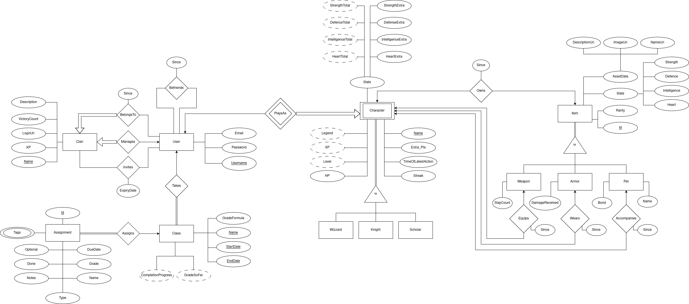

# Estudiántica

## Tabla de contenidos

* [Argumento](#argumento)
* [Especificación](#especificación)
* [Diseño](#diseño)
    * [Base de datos](#base-de-datos)
    * [Interfaz de usuario](#interfaz-de-usuario)
    * [Diagrama de clases](#diagrama-de-clases)

## Argumento
Convertirse en el mejor estudiante que uno puede ser es difícil. A pesar de
saber lo que debemos hacer, es fácil distraerse con algo más. Las buenas
prácticas son buenas y las malas prácticas son malas, pero no basta con
saber cuál es cuál.

Nuestro producto no sólo facilita que el estudiante planee su trayectoria
académica, sino también que pueda administrar su vida escolar y mantenerse fiel
a sus metas con ayuda de la
[*ludificación*](https://es.wikipedia.org/wiki/Ludificaci%C3%B3n).
El estudiante
podrá organizar sus tareas, prácticas y exámenes, evaluando su progreso y
también sus logros. A lo largo del ciclo escolar se planteará metas y se verá
recompensado al cumplirlas.

Con *Estudiántica*, buscamos darle un poco de emoción a la vida del estudiante
promedio, ayudando a que tome el control de sus estudios a través de incentivos
en forma de un *videojuego-agenda*. El estudiante va a generar hábitos positivos
con recompensas estilo *RPG* como: habilidades, items, mascotas y armaduras con
estilo. Enfrentándose a las hordas de tareas y a los malvados profesores (por
supuesto no todos) que se encuentre en su camino, el estudiante podrá recolectar
distintas mejoras para su personaje, así como para su vida académica.

## Especificación
El componente más escencial de la aplicación es una agenda escolar. El aspecto
de *ludificación* sirve para motivar al estudiante a interactuar con los
sistemas de la agenda a través de incentivos y consecuencias.

Para empezar a usar *Estudiántica* el usuario debe ingresar la fecha de incio y
término de su periódo escolar actual (bimestre, cuatrimestre, semestre, etc.) y
la carga de materias. Cada materia se puede personalizar agregándole las
siguientes calificaciones subjetivas: el interés que tiene el estudiante por la
materia y el grado de dificultad de esta. Opcionalmente también se pueden
asignar porcentajes personalizados al peso total de tareas, prácticas y examenes
en la calificación de cada materia (por defecto 50/50 entre tareas/prácticas y
examenes).

A partir de esto, se da lugar a la interacción principal de la agenda: la carga,
personalización y manejo de trabajos. Las tareas/prácticas y las evaluaciones no
tienen mayor distinción fuera del peso que tienen para la calificación de cada
materia. Para subir un trabajo se deben configurar los siguientes aspectos: la
materia a la que pertenece el trabajo, su fecha de entrega y un tiempo aproximado
para completarse.

El estudiante tendrá acceso a distintas métricas respecto a su desempeño como:
calificación promedio por materia, porcentaje de trabajos entregados y
puntualidad en realizar tareas. Además, podrá ver una lista de todos sus
pendientes en el orden en el que se entregan. La aplicación alertará dentro de
un periódo configurable que el estudiante debería empezar a trabajar en una
tarea. Para poder trabajar parcialmente en una tarea se le pueden agregar campos
que son subtareas para realizarla, por ejemplo: escribir el borrador del
documento, leer las notas correspondientes, contestar las primeras dos
preguntas, etc.

En el aspecto más básico de *ludificación* tu personaje tendrá métricas como
salud, experiencia, fuerza y habilidad. El personaje podrá subir de nivel a
través de buen desempeño académico y buena organización al entregar trabajos.
Por otro lado, perderá experiencia al tener calificaciones bajas o no
aprobatorias. Como incentivo adicional, obtener una califiación perfecta en una
evaluación tendrá una recompensa especial en el juego, como un insta-heal para
su personaje.

La aplicación contará con un componente social que permitirá a los estudiantes
unirse a grupos de estudio (*guilds*), donde podrán compartir progreso,
motivarse entre sí y participar en desafíos académicos en grupo. Además, cada
estudiante podrá visualizar un resumen de su desempeño por materia.

Para ayudar a la administración del tiempo y la motivación, se implementará un
período de gracia donde si cumple con el resto de sus pendientes se anularan las
consecuencias negativas y podrá obtener una recompensa adicional, pero si no lo
logra, perderá aun más experiencia.

El progreso en el juego estará vinculado al rendimiento académico. A medida que
el estudiante sube de nivel en la aplicación, desbloqueará perks especiales,
como la capacidad de realizar una tarea un día antes sin recibir penalización.
Además, el personaje del estudiante tendrá estadísticas que reflejarán su
desempeño, tales como concentración, disciplina y gestión del tiempo, las cuales
podrán mejorar con buenos hábitos.

Por último, de manera opcional, los estudiantes podrán elegir entre diferentes
clases dentro del juego, como el estratega, el multitarea o el metódico, cada
una con habilidades que influirán en la manera en que interactúan con la agenda
y los incentivos de la aplicación.

## Diseño

Como parte del desarrollo del problema, se tiene el diseño de la base de datos,
de los módulos y de la vista para el usuario.

### Base de datos

Para esto, tendremos las siguientes entidades, resumidas a continuación:
   - User: contiene la información de los usuarios para la aplicación, de esta
     manera se requiere un nombre de usuario, correo y contraseña.
   - Clan: es un grupo social dentro de la aplicación donde los distintos
     usuarios se pueden relacionar, el cuál contiene un nombre,una descripción,
     números de victorias, logotipo y experiencia.
   - Character: es el personaje del usuario dentro del videojuego, donde existe
     tres distintas clases (mago, caballero y erudito), donde cada personaje
     tiene su nombre, experiencia, nivel, leyenda, vida, última vez que estuvo
     en acción, su racha y sus stats (máximo de vida, inteligencia, defensa y
     fuerza).
   - Item: son los objetos que el personaje puede llevar, el cual tiene
     información de los mismos stats (fuerza, defensa, inteligencia y vida),
     rareza y dependiendo de su tipo puede tener las siguientes
     características:
     - Weapon: debe tener el número de eliminaciones.
     - Armor: debe de tener el nivel de daño recibido.
     - Pet: tiene el vinculo y su nombre.
   - Class: son las materias que los usuarios tienen las cuales deben de tener
     su nombre, fecha de inicio y fin, y fórmula de calificación.
   - Assignment: es la lista de deberes del estudiante, la cual debe de tener
     nombre, calificación, tipo, fecha de finalización, notas, si es opcional y
     tags (las cuales pueden ser varias).

Las entidades se tomaron de esta manera, ya que engloba la mayoría de las
acciones que hará la aplicación y nos permite acoplarlo con el resto de los
módulos, los cuales se detallarán en la siguiente sección.

Procedamos dando una descripción más detallada del diseño.

Partiendo por el usuario, esta entidad se encargará de toda la información de
la cuenta separada de las mecánicas de juego mismas. Sus atributos serán el
nombre de usuario, un hash de la contraseña, y correo electrónico para los
recordatorios y recuperación de la cuenta.

Un usuario puede agregar como amigo a otro usuario. Ambos deben agregarse como
amigos para que tengan acceso a las características de amistad, por lo tanto
será una tupla no conmutativa.

Los clanes son grupos de estudio, en los cuales puede un estudiante pertenecer
sólo a uno, y es administrado por sólo un usuario. Además, un clan puede
invitar a varios usuarios, con una fecha de expiración por invitación. Cuentan
con un logo, descripción, nombre, su propio XP por actividades completadas, y
número de victorias.

Un usuario puede tomar varias clases. Se puede registrar una fórmula para
calcular el promedio, que pueden ser construidas componiendo funciones
aritméticas simples, como suma, resta, producto, división, promedio, máximo y
mínimo, sobre las tareas con ciertas etiquetas.

Las clases se identifican por no sólo sus nombres, pues podría alguien
recusarlas, pero también por su fecha de inicio y término. Además debería ser
posible conocer el promedio con el progreso actual, y cuánto falta para
completar la materia.

Las clases dejan *asignaciones*, las cuales pueden ser tareas, exámenes,
prácticas, material, y demás. Estas cuentan con un id generado por la base
de datos, un conjunto de etiquetas, valores booleanos de si está realizada y
si es opcional, tiene fecha de entrega opcional, la calificación obtenida
(o si aún no está obtenida), notas adicionales y nombre de tarea.

A partir de la entidad de personaje comienza todo lo relacionado con los
elementos de juego. El personaje mismo debe ser uno de tres clases, un
hechicero, un caballero o un erudito.

El personaje tiene un nombre separado del nombre del usuario, pues el personaje
puede perderse por falta de consistencia y resultados. En ese caso, se pierde
el progreso de los componentes de juego, pero no de los datos de la cuenta del
usuario. Por esta razón precisamente está separado el personaje del usuario.

Para lo anterior, se cuenta con una fecha de última acción del personaje para
calcular el tiempo de inactividad, así como la racha para poder calcular
recompensas adicionales y el HP (salud) si le va mal en sus asignaciones.
Hilando con lo anterior, la experiencia y nivel del usuario será calculada a
partir de las tareas realizadas por el usuario, pero cualquier recompensa
adicional se guardará en el atributo de puntos extra.

La leyenda será una cadena calculada a partir del historial del usuario, la
cual relate sus hazañas a él mismo y a otros usuarios, para promover el aspecto
social y de sentimiento de logro.

El personaje contará con estadísticas que determinarán su éxito en eventos.
Estos serán su fuerza, defensa, inteligencia y corazón, los cuales serán
determinados por los *items* que tenga y además puntos adicionales por
rubro asignados al subir de nivel.

Un personaje es dueño de varios *items*, los cuales pueden ser un arma, una
armadura o una mascota. A pesar de ello, un personaje puede equipar a lo más
uno de estos tipos de *items*.

Estos *items* cuentan con diversas estadísticas que corresponden con las de
los personajes. Además, cuentan con un identificador breve de su descripción,
imagen y nombre, para que en caso de cambiarlos, no haya que encontrar todas
las instancias y además ahorrar espacio. Estos datos se encontrarían en el
servidor de recursos. También cuentan con una rareza.

Las instancias de *items* son generadas por el backend a partir de plantillas
especificadas en él. Estas plantillas tienen el rango de estadísticas por tipo
de item, a partir de las cuales se generan *items* con estadísticas particulares
únicas, para maximizar la reutilización de nuestros *assets*.

Además, cada clase tiene alguna propiedad a conservar para que el usuario
conozca su apego a aquél *item*. Para el arma es sus eliminaciones, para la
armadura es el daño que ha evitado recibir al personaje, y para la mascota es
su lazo.

### Diagrama de clases
El programa se divide en varias clases, las cuales componen todo el
comportamiento, de este modo se divide en las siguientes secciónes.

#### User module
Este módulo esta encargado de realizar las operaciones con la clase User y las
relaciones con Clans, utilizando clases tipo DAO. Las clases de este módulo
son:
   - User: clase que tiene la información del usuario y a su vez, maneja la información de su login.
   - Clans: clase que tiene la información del Clan, basada en el módelo entidad-relación, con las
     operaciones para agregar o eliminar integrantes.
   - UserDao y ClansDao: clases para realizar las operaciones en bases de datos

#### Studen Module
Este módulo se encarga de manejar la información relacionada a la parte de la
vida estudiantil (respecto a tareas) del usuario, principalmente la clase Class
y Assigment, con suy respectivo Dao. La información especifica de cada uno esta
dada por lo siguiente:
   - Class: clase que refleja la materia basada en el módelo entidad-relación.
   - Assigment: es la clase que refleja las tareas de un alumno.
   - Class Dao y Assigment Dao: clases que realizan las operaciones internas de la base de datos.

#### Event module
Se encarga de realizar las notificaciones para el usuario con respecto a las
tareas de su escuela, donde se tiene las notificaciones de los eventos y sus
descripciones.

#### RPG module
Es el encargado de simular toda la parte de RPG de la aplicación,
principalmente del uso del personaje y de los items que este puede llevar con
sus respectivos Dao, donde cada esta detallada como:
   - Character: clase que es el personaje del usuario con las distintas acciones del mismo.
   - Item: indica el comportamiento de los items, donde se tiene la información y deriva en Armor, Weapon
     y Pet
   - BackPack: indica todos los elementos que tiene el usuario.

#### Controller module y ORM module
Indica todos los controladores para las clases principales y el ORM general,
utilizando un singleton.

#### Cuenta Module, Stats Module y Agenda Module
Estos módulos se encargan de mostrar en la parte visual del programa la
información de las entidades del programa, especificamente de la información
del usuario.

Para Cuenta module, se tienen las siguientes clase:
   - User view, es la vista de la información del usuario.
   - User Settings, clase que ayuda a modificar la información del usuario.
   - Clan, indica los detalles del clan del usuario.
   - Friends, muestra los amigos del usuario.

Para Stats module, contiene las siguientes clases:
   - Stats view: vista de los stats del usuario.
   - ClassProgress: clase que muestra el progreso de la materia.
   - AssigmentProgress: progreso de las tareas.
   - Stats y Average: muestra los stats del usuario y el promedio del mismo

#### View module y Resources module
Clase que muestra la parte visual de la aplicación y de los recursos que
utilice el mismo.

#### Dungeon module y DungeonView module
Estos módulos se encargan de mostrar y modificar la información de las Dungeon,
las cuales es un aditamento especial de nuestro sistema.

Las clases del módulo Dungeon, tiene la siguiente información:
   - DungeonEvent: tiene el calabozo del momento, donde guarda el listado de usuarios que
     estan completando, los que ya se retiraron de la contienda y notifica al usuario de
     su avance. De este modo, se tiene tres tipos de calabozo:
     - BasicDungeon
     - AdvancedDungeon
     - SpecialDungeon
   - itemGenerator: contiene la generación de los items del calabozo.

Las clases que tiene el módulo DungeonView son:
   - DungeonView: clase que encapsula la vista del calabozo.
   - Items: clase que muestra la vista de los items.
   - Progress: muestra la información del progreso de la clase.
   - Character: clase que visualiza el personaje del usuario en el calabozo.

### Interfaz de usuario

Para esto, se divide la aplicación en los siguientes apartados con su respectivo maquetado:
   - Login: En este apartado, se mostrará las funciones para ingresar a la aplicación y para poder crear
     tu perfil.
   - Profile: En este apartado, podras realizar la personalización de tu personaje, ver las tareas que tienes
     como prioridad (fecha o importancia) y configuración de tu perfil.
   - Dungeon: se puede ver la información de la mazmorra actual con las recompensas disponibles e
     información.
   - Clan: aqui se puede ver la información de los miembros, personalización del clan y edición de
     información importante.
   - Assigment: aqui se podra consultar el calendario con las actividades, y aqui mismo se podran agregar
     más tareas con su respectiva materia. A su vez, podra modificar las ya existentes usando una busqueda
     por nombre o similar.
        

